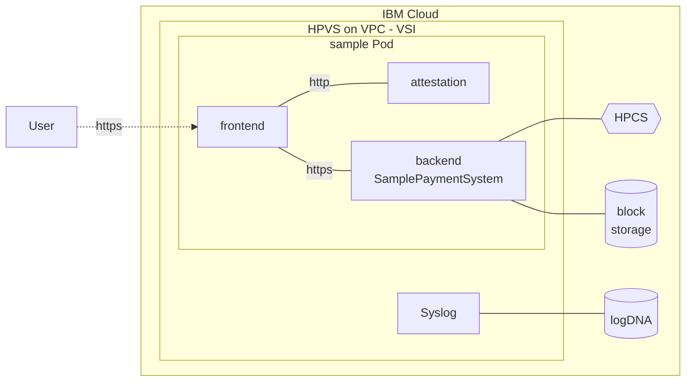

# Applying Data Protection and Confidentiality in a Hybrid Cloud Environment - Samples
This repository contains sample code for the redbook
_SG248555: IBM Hyper Protect Platform: Applying Data Protection and Confidentiality in a Hybrid Cloud Environment_.
The redbook can be found at https://ibm.com/redbooks.

The authors of the redbook come from the IBM Hyper Protect Services (HPS) organization and they are:

- Bill White
- Robbie Avill
- Sandeep Batta
- Abhiram Kulkarni
- Timo Kußmaul
- Stefan Liesche
- Nicolas Mäding
- Christoph Schlameuß
- Peter Szmrecsányi

## Content
### hps-util
Simple golang utility using keys with an HPCS instance.

### samplepaymentsystem
Demo web application that can be deployed within a HPVS instance.

### terraform-hpcs
Deploys a HPCS instance.

### terraform-hpvs
Deploys a multi-tier sample (samplepaymentsystem) application to IBM Cloud including a reverse proxy.

<!--

-->

#### Endpoints
|Location|Use|
|-|-|
|`https://<IP>/`|SamplePaymentSystem|
|`https://<IP>/se-checksums.txt`|Attestation Checksums|
|`https://<IP>/se-checksums.txt.enc`|Encrypted Attestation Checksums|
|`https://<IP>/se-signature.bin`|Attestation Signature|
