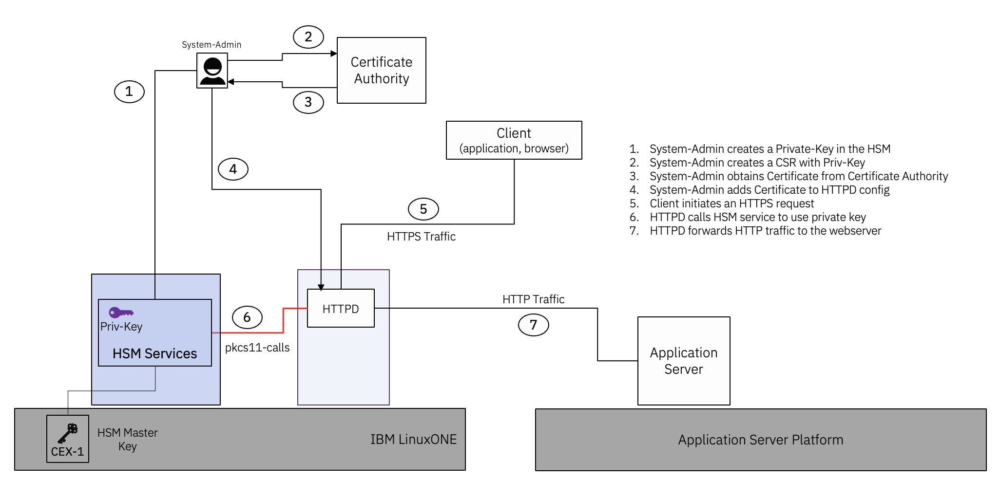

# Offload TLS with Apache HTTPD and RHEL 8.10 on IBM Z LinuxONE HSM
Offloading TLS allows for a single, centralized point of control and management

By Sandeep Batta, Timo Kussmaul, Robbie Avill

[Transport Layer Security (TLS)](https://en.wikipedia.org/wiki/Transport_Layer_Security) encrypts communications between the client and the webserver to protect against potential hackers and man-in-the-middle attacks. While encryption protects data, it introduces latency because of the additional processing the webserver must do to unencrypt data before it can be processed.

"TLS offloading" is the process of using a [Hardware Security Module (HSM)](https://en.wikipedia.org/wiki/Hardware_security_module) to redirect encrypted traffic, away from the webserver, to alleviate its processing load. This process "offloads" the TLS encryption and decryption to the HSM, instead of letting / trusting web server to do so, which significantly reduces the risk of key compromise. It also helps with the following tasks: 
- Generating the SSL key pair on a HSM or cryptographic service
- Storing the SSL private key on a HSM or cryptographic service
- Performing the crytpographic operations for SSL on a HSM or cryptographic service

For more background, see [self-signed certificate](https://en.wikipedia.org/wiki/Self-signed_certificate), [certificate signing request (CSR)](https://en.wikipedia.org/wiki/Certificate_signing_request), and [CA certificates](https://en.wikipedia.org/wiki/Certificate_authority).

## Learning Objectives
This tutorial explains how to use [Apache HTTPD](https://httpd.apache.org) on [RHEL 8.10](https://access.redhat.com/articles/3078#RHEL8) to perform TLS offloading using private encryption keys that are protected by an **on-premise** [FIPS 140-2 Level 4 HSM](https://en.wikipedia.org/wiki/FIPS_140-2#Level_4) [IBM LinuxONE](https://www.ibm.com/linuxone). The setup will look something like this:



## Estimated time
If all of the prerequisites are in place, it should take you no more than 30 minutes to complete this tutorial.

## Pre-requisites
- Access to a RHEL 8.10 server
- Access to `on-premise` HSM / GREP11 Services on LinuxONE; you will need the following information:
  - IP address to access the GREP11 server
  - Port number to access the GREP11 server
  - Certificates to access the GREP11 server, specifically
    - GREP11 CA Certificate
    - Client Certificate
    - Client Key
- Access to a Certifcate Authority (CA) to create a Certificate from a CSR that being created using a  `private-key` created with the HSM
- 2 x UUIDs - you can use an [UUID-Generator](https://www.uuidgenerator.net)
  - UUID-#1 - for the Normal HSM user
  - UUID-#2 - for the Anonymous HSM user

## Step 1. Prepare the server
1. Logon to your `RHEL 8.10` server
1. Create required directory structure
   ```
   mkdir -p /etc/ep11client/certs
   mkdir -p /etc/pki/tls/certs
   ```
1. Install packages 
   ```
   yum install -y wget "libp11*" "httpd*" mod_ssl gnutls-utils
   ```

## Step 2. Configure GREP11-HSM access
1. Download `pkcs11-grep11` library
   ```
   cd /etc/ep11client
   wget https://github.com/IBM-Cloud/hpcs-pkcs11/releases/download/v2.6.8/pkcs11-grep11-s390x.so.2.6.8
   ln -s pkcs11-grep11-s390x.so.2.6.8 pkcs11-grep11.so
   ```
1. Copy the `certificates` for GREP11-HSM to `/etc/ep11client/certs`, you should have the following files:
   - /etc/ep11client/certs/client.key  - private client key to access the server
   - /etc/ep11client/certs/client.pem  -  client certificate to access the server
   - /etc/ep11client/certs/grep11-ca.pem - GREP11 root CA certificate
1. Copy [sample-grep11client.yaml](configuration-files/tlsoffload-onpremise-grep11client.yaml) to `/etc/ep11client/grep11client.yaml`
1. Update the following in `/etc/ep11client/grep11.client.yaml`
   - `<GREP11-ENDPOINT-IP>` - IP address to access the GREP11 Server
   - `<GREP11-ENDPOINT-PORT>` - Port number to access GREP11 Server
   ```
   export uuid1=$(uuidgen)
   export uuid2=$(uuidgen)
   sed -i -e "s/<UUID-#1>/$uuid1/g" /etc/ep11client/grep11client.yaml
   sed -i -e "s/<UUID-#2>/$uuid2/g" /etc/ep11client/grep11client.yaml
   ```
1. Identify the PKCS11-GREP11 module to the host server
   ```
   echo "module: /etc/ep11client/pkcs11-grep11.so" > /etc/pkcs11/modules/pkcs11-grep11.module
   ```
1. Create a Keystore in GREP11 server, with the `init-token` command:
   ```
   p11tool --initialize "pkcs11:model=GREP11;manufacturer=IBM" --label grep11 
   ```
## Step 3. OpenSSL configuration
1. Add the following lines to the file `/etc/pki/tls/openssl.cnf`, just before the `[ default_modules ]` section: 
   ```
   engines = engine_section

   [engine_section]
   pkcs11 = pkcs11_section

   [pkcs11_section]
   engine_id = pkcs11
   dynamic_path = /usr/lib64/engines-1.1/libpkcs11.so
   MODULE_PATH = /etc/ep11client/pkcs11-grep11.so
   PIN = 12345678
   init = 0
   ```
1. Check if `openssl` is setup correctly:
   ```
   openssl version -a
   openssl engine -t pkcs11
   ```
   
## Step 4. Create SSL private key and certificates with HSM
1. Create Private Key in the HSM with the label `httpdsslkey`:
   ```
   p11tool --provider /etc/ep11client/pkcs11-grep11.so --login --generate-rsa --bits 2048 --label "httpdsslkey" --outfile httpdsslkey.pub "pkcs11:model=GREP11;manufacturer=IBM"
   ```
1. Construct the URL for the Private Key in HSM
   ```
   p11tool --provider=/etc/ep11client/pkcs11-grep11.so --list-all 1>/tmp/p11tool-output
   export URL=$(cat /tmp/p11tool-output | grep -e "URL" | grep -e "object=httpdsslkey" | awk -F 'URL: ' '{print $2}' | sed 's/public/private/')
   ```
1. Construct the `key` to be used for HSM calls
   ```
   export key=$URL";pin-value=12345678"
   ```
1. Create Certificate Signing Request (CSR) with private key in the HSM
   ```
   cd /etc/pki/tls/certs
   openssl req -engine pkcs11 -keyform engine -key $key -subj "/C=US/ST=New York/L=Armonk/O=IBM/OU=CIO/CN=www.example.com" -new -out www.example.com-csr
   ```
1. Use the file `www.example.com-csr` to generate a certificate chain. You should get the following files back from the Certificate Authority (CA):
   - Leaf Certificate
   - Intermediate Certificate
   - Root Certificate
1. Concatenate the `Leaf` and `Intermediate` certificates, one after the other, in the file `/etc/pki/tls/certs/www.example.com-bundle.crt`
1. You should now have the following files in `/etc/pki/tls/certs`
   ```
   www.example.com-bundle.crt
   www.example.com-csr
   ``` 

## Step 5. HTTPD configuration
1. Edit and adapt file `/etc/httpd/conf.d/ssl.conf`.
    - Enable SSL:
      ```
      SSLEngine on
      ```
    - Define the SSL certificate file:
      ```
      SSLCertificateFile /etc/pki/tls/certs/www.example.com-bundle.crt
      ```
    - Define the SSL certificate key file. The following line is an example. You will need to add your key URL instead:
      ```
      SSLCertificateKeyFile "pkcs11:model=GREP11;manufacturer=IBM;serial=000%2F0000;token=test;id=%1A%E3%C9%29%64%96%50%5E%BD%45%89%B2%5F%21%52%F3%1B%C3%0D%13;object=httpdrsa1;type=private;pin-value=12345678"
      ```
1. Copy [sample-ssl-index.html](configuration-files/tlsoffload-index.html) to `/var/www/html/index.html`
1. Restart Apache HTTPD
   ```
   httpd -X
   ```
   *Note*: the flag `-X` is a temporary measure to run HTTPD in single-threading mode, without forking

## Step 6. Test if TLS-Offload is working
1. Map host name `www.example.com` to the IP-address of your server by editing your local (client) hosts-file.
1. Open a browser and go to [https://www.example.com:443](https://www.example.com:443). If everything is working as expected, you must see a page with the following message:
   
    **Welcome to TLS Offload with HTTPD, OpenSSL & GREP11 service on a LinuxONE HSM!**


## Conclusion
Offloading TLS with an HSM allows for a single, centralized point of control and management of "Private Keys" used to create certificates. If HSM services are part of a larger "Encryption Services Platform", policies can be created to align with an organization's security policies. This greatly simplifies the administration overhead and also allows for separation of the security role from the application owner role to the security admin.

The procedure described here is applicable, with some modifications, to other load balancers, web application firewalls, caching servers, etc.
