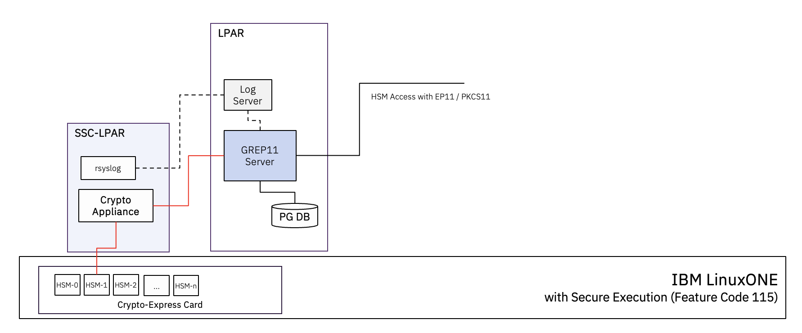
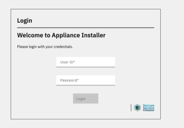
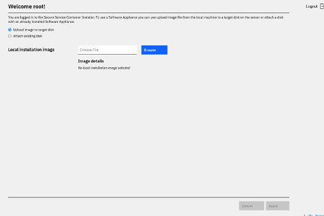
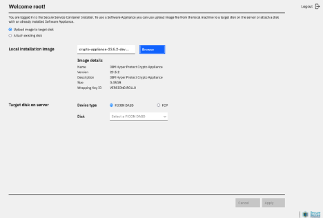
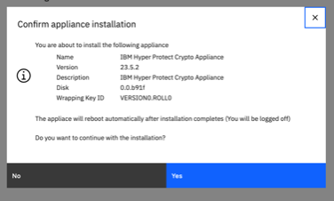
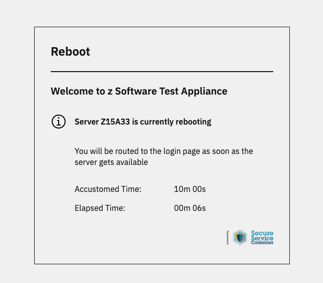

# Easy to Use: Crypto Appliance
The *Crypto Appliance* provides a mechanism for secure connection to a Hardware Security Module (HSM) domain on IBM Crypto Express Card, from a Secure Execution VM, on a Secure Service Container (SSC) LPAR, to provide the required security. An SSC LPAR contains its own embedded
operating system, security mechanisms, and other features that are specifically designed for: 
- Quicker and simpler installation of software appliances
- End-to-end appliance tamper protection
- Protect intellectual property of appliance components

The "Crypto Appliance" is built on the "SSC SDK" and provides REST API access for Admins on the one hand and, acts as a conduit for external entities like a GREP11 server to consume HSM services, as shown in the picture below:


<br>Fig.1 A typical Crypto-Appliance setup in the Hyper Protect context

The HSM-Domain, also sometimes referred to as the *crypto-domain*, must be assigned to the SSC-LPAR where Crypto-Appliance is running, and initialized with a *Master Key* through a Trusted Key Entry (TKE) process. The TKE Process itself is outside the scope of this tutorial. 

## Pre-requisites
### Pre-1: Confirm all the required resources / info are available
- IBM Z or LinuONE with the following feature codes:
  - 0103 - SSC, which is a specialized container for installing and running specific appliances.
  - 0104 - SSC for IBM Cloud Private, which is a software appliance framework that is designed to securely host Linux container-based applications
  - 0115 - Secure Execution
- Access to an SSC LPAR, with
  - 1 IFL, 6gb mem
  - 50gb storage, usually provided on a FICON DASD - make a note of what is assigned by the System Admin
  - **Secure Service Container Installer** as the boot option on the HMC
  - IP address to access the `installer` - CRYPTO_APPLIANCE_IP
  - Master UserID for the SSC LPAR - CRYPTO_APPLIANCE_USERID
  - Password for the SSC LPAR - CRYPTO_APPLIANCE_PASSWD
- An HSM Domain
  - initialized with a Master Key
  - assigned to the SSC LPAR
- IP-address of a Logging Server - LOOGING_SERVER_IP (local SYSLOG may be used and can be semi-automativally configured using script - see step2)
- Access to a Crypto Services Provider facility, like the GREP11 server shown in Fig. 1
- Access to *IBM Passport Advantage* with entitlement for Hyper Protect Virtual Server, to download the Crypto Appliance image
- Access to an API management tool like "Postman" / "Swagger" / etc
- Read through the official documentation on [Configuring Crypto Express Network API](https://www.ibm.com/docs/en/hpvs/2.2.x?topic=cenasee-configuring-crypto-express-network-api-secure-execution-enclaves)

For more details about configuring the SSC LPAR, check the [SSC User Guide](https://supportcontent.ibm.com/support/pages/system/files/inline-files/631420_SC28-6978-02a.pdf)

### Pre-2: Download the Crypto Appliance image
*to be done on `your workstation`*
1. Logon to [IBM Passport Advantage](https://www.ibm.com/software/passportadvantage/pao_customer.html)
1. Follow [Downloading Crypto Express Network API](https://www.ibm.com/docs/en/hpvs/2.2.x?topic=dcenasee-downloading-crypto-express-network-api-secure-execution-enclaves-major-release) to download the following files
   ```
   Cryp-Exp-API-for-SE-1.1.3-public.pem.cer
   Cryp-Exp-API-for-SE-1.1.3.tar.gz.sig
   Cryp-Exp-API-SE-1.1.3-public.pem.chain
   Crypto-Express-API-for-SE-<version>.tar.gz
   ```
1. Unpack the tar file
   ```
   tar -xvfz Crypto-Express-API-for-SE-1.1.3.tar.gz
   ```
   the following files must be available in the unpacked folder
   ```
   Crypto-Express-API-for-SE_1.1.3.img.gz
   grep11server-s390x_1.1.3.tar
   README-Crypto-Express-API-for-SE_1.1.3.txt
   ```

## Step 1. Install Crypto Express Network API / Crypto Appliance
*to be done on `your workstation`*

1. Logon to the SSC Appliance UI at this IP address `CRYPTO_APPLIANCE_IP`, with `CRYPTO_APPLIANCE_USERID` and `CRYPTO_APPLIANCE_PASSWD`
  <br>
1. Select image file `Crypto-Express-API-for-SE_1.1.3.img.gz`:
  <br>
1. Verify and select FICON DASD (check with the system admin before selecting one, otherwise you may overwrite another system):
  <br>
1. Apply the configuration
  <br>
1. After a while you should see reboot screen:
  <br>
1. After the reboot, with the Crypto Appliance it's normal to see 404 error as there is no HTTP access, only API access is available from this point onwards. *If an error occurs… retry!*

## Step 2. Configure the Crypto Appliance

There are two options here:
 - Using a helper script by following this [guide](https://github.ibm.com/ZaaS/zcat-assets/blob/main/tutorials/CryptoApplianceSetupPackage.md) that will configure the crypto appliance automatically and will also create the certificates and mkae available the instructions to configure the local linux as a SYSLOG server for the Crytpo Appliance as well as help stand up a grep11 container connected to the crypto appliance)
 - Manually following instructions below that require knowledge on how to execute API commands (there are CURL examples in the first two steps)

### a) Obtain an API-token to communicate with the Crypto Appliance
*to be done on `your workstation`*

1. Fire up your favorite API-management tool
1. Obtain API-token as follows:
   ```
   POST https://{CRYPTO_APPLIANCE_IP}/api/com.ibm.zaci.system/api-tokens HTTP/1.1
   zACI-API: com.ibm.zaci.system/1.0
   Accept: application/vnd.ibm.zaci.payload+json;version=1.0
   Content-type: application/vnd.ibm.zaci.payload+json;version=1.0

   {
      "kind": "request",
      "parameters": {
         "user": "CRYPTO_APPLIANCE_USER",
         "password": "CRYPTO_APPLIANCE_PASSWD"
       }
   }
   ```
   Alternatively you can use `curl` to do this and store in an environment variable for future `curl`/API commands:
   ```
   req_json=$(cat << EOF
   {
      "kind": "request",
      "parameters":{
         "user":"CRYPTO_APPLIANCE_USER",
         "password":"CRYPTO_APPLIANCE_PASSWD"
      }
   }
   EOF
   )
   auth_token=$(curl -k -X POST https://${CRYPTO_APPLIANCE_IP}/api/com.ibm.zaci.system/api-tokens -H 'zACI-API: com.ibm.zaci.system/1.0' -H 'Content-type: application/vnd.ibm.zaci.payload+json;version=1.0' -H 'Accept: application/vnd.ibm.zaci.payload+json' -d "${req_json}" | jq -r .parameters.token)
   ```
   
1. Make a note of the `API-Token` received.

*Note:*You may need to refresh the API-Token, as and when it expires, to continue working with the crypto appliance

### b) Accept the Software License if you agree with the terms
*to be done on `your workstation`*

1. Download the Software License Agreement
   ```
   GET https://{{host}}/License/Lic_en.txt HTTP/1.1
   Content-Type: text/plain
   ```
   ```
   GET https://{{host}}/License/non_ibm_license.txt HTTP/1.1
   Content-Type: text/plain
   ```
1. Accept the terms
   ```
   PUT https://{CRYPTO_APPLIANCE_IP}/api/com.ibm.zaci.system/software-license HTTP/1.1
   zACI-API: com.ibm.zaci.system/1.0
   Authorization: Bearer {{login.response.body.parameters.token}}
   Accept: application/vnd.ibm.zaci.payload+json;version=1.0
   Content-type: application/vnd.ibm.zaci.payload+json;version=1.0
   {
      "kind": "request",
      "parameters": {
         "accept": true
       }
   }
   ```
   Altenatevly if you're using `curl` and have the beare token stored in `auth_token` as above:
   ```
   curl -ks -X GET "https://${CRYPTO_APPLIANCE_IP}/api/com.ibm.zaci.system/software-license" -H 'zACI-API: com.ibm.zaci.system/1.0' -H 'Content-type: application/vnd.ibm.zaci.payload+json;version=1.0' -H 'Accept: application/vnd.ibm.zaci.payload+json;version=1.0' -H "Authorization: Bearer ${auth_token}"
   req_json=$(cat << EOF
   {
      "kind": "request",
      "parameters":{
         "accept": true
      }
   }
   EOF
   )
   curl -sk -X PUT https://${appliance_ip}/api/com.ibm.zaci.system/software-license -H 'zACI-API: com.ibm.zaci.system/1.0' -H 'Content-type: application/vnd.ibm.zaci.payload+json;version=1.0' -H 'Accept: application/vnd.ibm.zaci.payload+json' -H "Authorization: Bearer ${auth_token}" -d "${req_json}" | jq -r
   ```
   
### c) Make sure server is running as expected
*to be done on `your workstation`*

```
GET https://{CRYPTO_APPLIANCE_IP}/api/com.ibm.crypto/server HTTP/1.1
zACI-API: com.ibm.zaci.system/1.0
Authorization: Bearer {{login.response.body.parameters.token}}
Accept: application/vnd.ibm.zaci.payload+json;version=1.0
```
### d) Reconfigure the HiperSocket on SSC LPAR (enable Layer 2)
*to be done on `your workstation`*

Execute the following script to get the interfaces that are available on the SSC LPAR:
```
#!/bin/bash

# Authenticate

export appliance_ip="{CRYPTO_APPLIANCE_IP}"
export admin_user="{CRYPTO_APPLIANCE_USER}"
export admin_pass="{CRYPTO_APPLIANCE_PASSWD}"

req_json=$(cat << EOF
{
   "kind": "request",
   "parameters":{
      "user":"${admin_user}",
      "password":"${admin_pass}"
   }
}
EOF
)

auth_token=$(curl -k -X POST https://${appliance_ip}/api/com.ibm.zaci.system/api-tokens -H 'zACI-API: com.ibm.zaci.system/1.0' -H 'Content-type: application/vnd.ibm.zaci.payload+json;version=1.0' -H 'Accept: application/vnd.ibm.zaci.payload+json' -d "${req_json}" | jq -r .parameters.token)

curl -k -X GET https://${appliance_ip}/api/com.ibm.zaci.system/network-connection/v1 -H 'zACI-API: com.ibm.zaci.system/1.0' -H 'Content-type: application/vnd.ibm.zaci.payload+json;version=1.0' -H 'Accept: application/vnd.ibm.zaci.payload+json' -H "Authorization: Bearer ${auth_token}" | jq
```
This will give you an output similar to the following:
```
      "name": "crypot-appliance-test",
      "id": "enc2400",
      "device": "enc2400",
      "state": "activated",
      "ipv4_method": "manual",
      "ipv4_addresses": [
        "192.168.6.4/24"
      ],
      "ipv6_method": "disabled",
      "ipv6_addresses": [],
      "ipv6_gateway": null,
      "ipv4_gateway": null,
      "ipv6_default_route": "yes",
      "ipv4_routes": [],
      "ipv4_default_route": "yes",
      "type": "802-3-ethernet",
      "subchannels": [
        "0.0.2400",
        "0.0.2401",
        "0.0.2402"
      ],
      "chpid": "FC",
      "portno": 0,
      "layer2": 0,
      "card_type": "HiperSockets",
      "driver": "qeth",
      "mac_address": "fe:31:fc:0b:00:02",
      "self": "/api/com.ibm.zaci.system/network-connection/v1/enc2400"
```
Identify the Hipersocket by looking for the identifier `"card_type": "HiperSockets"`, note that `"layer2": 0` and we need this enabled!

Looking above identify the following (needed for the next script):
 - `DEVICE_ID:` the long format HiperSocket identifier, foir number below `subchannels` = `0.0.2400`;
 - `NETWORK_IF_NAME` the network interface identier after `device` = `enc2400`;
 - `resource_url` the url from `self` = `/api/com.ibm.zaci.system/network-connection/v1/enc2400`

Now execute the following script to reconfigure the HiperSocket enabling Layer 2 (remeber to set the varibals acordlingly):
```
#!/bin/bash

# Variables 

export appliance_ip="{CRYPTO_APPLIANCE_IP}"
export admin_user="{CRYPTO_APPLIANCE_USER}"
export admin_pass="{CRYPTO_APPLIANCE_PASSWD}"
export DEVICE_ID="0.0.XXXX" # This is the long zID of the HS interface
export NETWORK_IF_NAME="encXXXX" # This is the short network interface ID name
export resource_url="/api/com.ibm.zaci.system/network-connection/v1/encXXXX" # This is the value from self property of the interface from the previous script
export ipv4_address="192.168.128.4" # The IP address of the CrA HS interface

# Authenticate

req_json=$(cat << EOF
{
   "kind": "request",
   "parameters":{
      "user":"${admin_user}",
      "password":"${admin_pass}"
   }
}
EOF
)

auth_token=$(curl -k -X POST https://${appliance_ip}/api/com.ibm.zaci.system/api-tokens -H 'zACI-API: com.ibm.zaci.system/1.0' -H 'Content-type: application/vnd.ibm.zaci.payload+json;version=1.0' -H 'Accept: application/vnd.ibm.zaci.payload+json' -d "${req_json}" | jq -r .parameters.token)

# Delete interface
curl -k -X DELETE https://${appliance_ip}${resource_url} -H 'zACI-API: com.ibm.zaci.system/1.0' -H 'Content-type: application/vnd.ibm.zaci.payload+json;version=1.0' -H 'Accept: application/vnd.ibm.zaci.payload+json' -H "Authorization: Bearer ${auth_token}"

# Create new HS connection
req_json=$(cat << EOF
{
    "kind":"request",
    "resource-name":"network-connection",
    "resource-version":"1.0",
    "parameters":{
          "type":"802-3-ethernet",
          "bus_id":"${DEVICE_ID}",
          "portno":0,
          "layer2":1,
          "name":"${NETWORK_IF_NAME}",
          "activate_connection":"yes",
          "ipv4_method":"disabled",
          "ipv6_method":"disabled"
    }
}
EOF
)

curl -k -X POST https://${appliance_ip}/api/com.ibm.zaci.system/network-connection/v1 -H 'zACI-API: com.ibm.zaci.system/1.0' -H 'Content-type: application/vnd.ibm.zaci.payload+json;version=1.0' -H 'Accept: application/vnd.ibm.zaci.payload+json' -H "Authorization: Bearer ${auth_token}"  -d "${req_json}"

# Add IP address
req_json=$(cat << EOF
{
    "kind":"request",
    "resource-name":"network-connection",
    "resource-version":"1.0",
    "parameters":{
        "portno":0,
        "name":"${NETWORK_IF_NAME}",
        "activate_connection":"yes",
        "ipv4_method":"manual",
        "ipv4_addresses":[
            "${ipv4_address}/24"
        ],
        "ipv6_method":"disabled"
    }
}
EOF
)

curl -k -X PUT https://${appliance_ip}${resource_url} -H 'zACI-API: com.ibm.zaci.system/1.0' -H 'Content-type: application/vnd.ibm.zaci.payload+json;version=1.0' -H 'Accept: application/vnd.ibm.zaci.payload+json' -H "Authorization: Bearer ${auth_token}"  -d "${req_json}"               

# Reboot Appliance
curl -k -X PUT https://${appliance_ip}/api/com.ibm.zaci.system/appliance/reboot -H 'zACI-API: com.ibm.zaci.system/1.0' -H 'Content-type: application/vnd.ibm.zaci.payload+json;version=1.0' -H 'Accept: application/vnd.ibm.zaci.payload+json' -H "Authorization: Bearer ${auth_token}"
```

### e) Setup Logging for Crypto Appliance
*to be done on `your workstation`*
** Need to check where the RSYSLOG is for CrA, as we usualy set one up on LPAR **
1. Follow [Prepare Log Server for Crypto Appliance](https://www.ibm.com/docs/en/hpvs/2.1.x?topic=cenasee-installing-crypto-express-network-api-secure-execution-enclaves#preparing-rsyslog-server-for-log-collection) instructions to setup RSYSLOD on LPAR3 and download the following:
   - rsyslog-ca.pem - Root certificate of rsyslog-server
   - rsyslog-client.pem - Rsyslog client certificate which will be used by crypto appliance to send logs to logging server
   - rsyslog-client.key - Rsyslog client key associated with the client-certificate
1. Convert the certificates to `base64` format
   ```
   cat rsyslog-ca.pem | base64 -w0 > rsyslog-ca.pem-base64
   cat rsyslog-client.pem | base64 -w0 > rsyslog-client.pem-base64
   cat rsyslog-key.pem | base64 -w0 > rsyslog-key.pem-base64
   ```
1. Upload the credentials to the Crypto-Appliance
   ```
   POST https://{CRYPTO_APPLIANCE_IP}/api/com.ibm.crypto/apilog
   zACI-API: com.ibm.zaci.system/1.0
   Authorization: Bearer {{login.response.body.parameters.token}}
   Accept: application/vnd.ibm.zaci.payload+json;version=1.0
   Content-type: application/vnd.ibm.zaci.payload+json;version=1.0
   {
       "kind":"request",
       "parameters":{
          "rsyslog_config":{
             "rsyslog_ca_root": "<rsyslog-ca.pem-base64>",
             "rsyslog_client_cert": "rsyslog-client.pem-base64>",
             "rsyslog_client_key": "<rsyslog client key in BASE64>",
             "rsyslog_server_ip": "192.168.128.9"
          },
          "c16server_log_config":{
             "loglevel": "info(default)|debug|trace|warn|err|error|critical|off"
          }
       }
   }
   ```

### f) Generate CSR to communicate with Crypto-Appliance 
1. Create the CSR   
   ```
   POST https://{CRYPTO_APPLIANCE_IP}/api/com.ibm.crypto/csr
   zACI-API: com.ibm.zaci.system/1.0
   Authorization: Bearer {{login.response.body.parameters.token}}
   Accept: application/vnd.ibm.zaci.payload+json;version=1.0
   Content-type: application/vnd.ibm.zaci.payload+json;version=1.0
   {
       "kind":"request",
       "parameters":{
           "mtls":{
               "server_common_name":"<CRYPTO_APPLIANCE_IP"
            }
        }
   }
   ```
   If the request succeeds, you can check the result in the log
1. Save the CSR into the file `c16server-ca.csr`

### g) Generate Certificate to communicate with Crypto-Appliance
1. Use the CSR to generate the certificates:
   - c16server-ca.pem
   - c16server-ca.key

  Either your corporate CA can be used, or follow the process [Create OpenSSL certificates for Crypto-Appliance](https://www.ibm.com/docs/en/hpvs/2.2.x?topic=cenasee-creating-openssl-certificates-crypto-express-network-api-secure-execution-enclaves#creating-openssl-certificates-for-crypto-express-network-api-for-secure-execution-enclaves)

1. Convert the certificates to Base64
   ```
   cat c16server-ca.pem | base64 -w0 > c16server-ca.pem-base64
   cat c16server-cert.pem | base64 -w0 > c16server-cert.pem-base64
   ```

## Step 9. Enable Crypto-Appliance for mTLS communication
```
POST https://{CRYPTO_APPLIANCE_IP}/api/com.ibm.crypto/configs HTTP/1.1
zACI-API: com.ibm.zaci.system/1.0
Authorization: Bearer {{login.response.body.parameters.token}}
Accept: application/vnd.ibm.zaci.payload+json;version=1.0
Content-type: application/vnd.ibm.zaci.payload+json;version=1.0

{
    "kind":"request",
    "parameters":{
        "mtls":{
            "client_ca_root": "<c16server-ca.pem-base64",
            "server_cert":"<c16server-cert.pem-base64>"
        }
    }
}
```

## Conclusion
For more interaction with the Crypto Appliance, follow instructions at [Configuring Crypto Express Network API](https://www.ibm.com/docs/en/hpvs/2.2.x?topic=cenasee-configuring-crypto-express-network-api-secure-execution-enclaves), for actions like
- Manage the Crypto-Appliance [Step 9](https://www.ibm.com/docs/en/hpvs/2.2.x?topic=cenasee-configuring-crypto-express-network-api-secure-execution-enclaves#tdd_5st_lgc__title__1)
- Get Domain list [Step 10](https://www.ibm.com/docs/en/hpvs/2.2.x?topic=cenasee-configuring-crypto-express-network-api-secure-execution-enclaves#udd_5st_lgc__title__1)
- Bind client certificate to target domain [Step 11](https://www.ibm.com/docs/en/hpvs/2.2.x?topic=cenasee-configuring-crypto-express-network-api-secure-execution-enclaves#vdd_5st_lgc__title__1)
- Get server configurations [Step 12](https://www.ibm.com/docs/en/hpvs/2.2.x?topic=cenasee-configuring-crypto-express-network-api-secure-execution-enclaves#wdd_5st_lgc__title__1)
