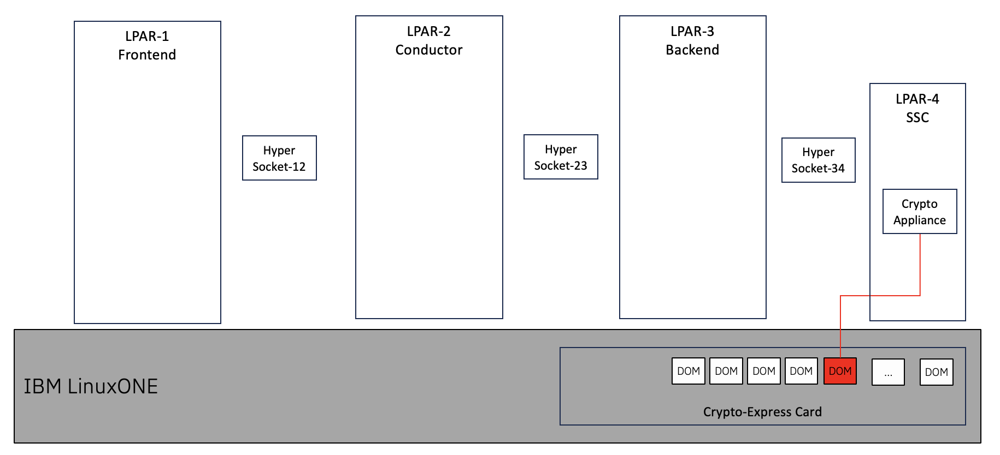
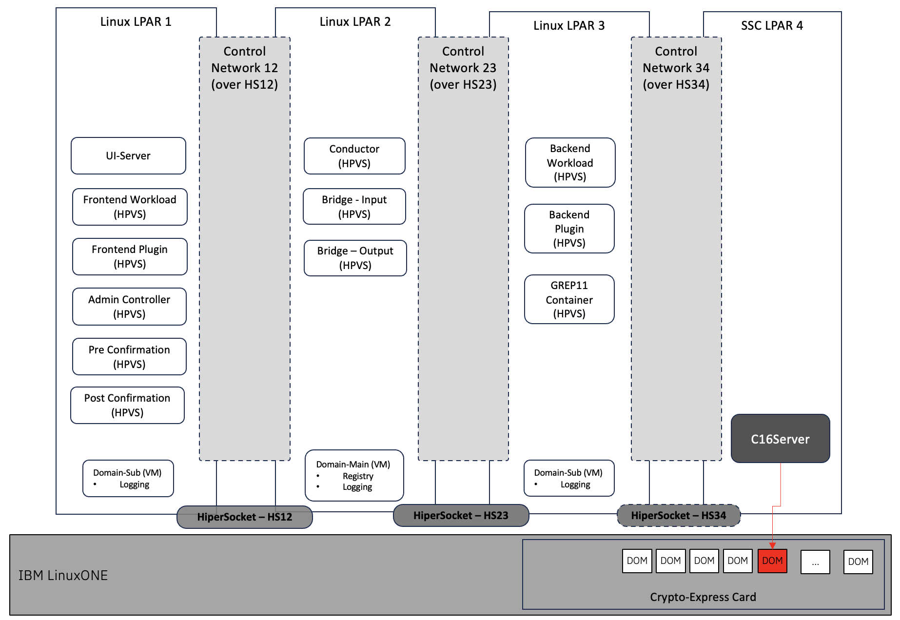

# Easy to follow OSO documentation
This doc is based on [OSO Documentation for OSO 1.4.x](https://www.ibm.com/docs/en/hpdaoso/1.4.0). It is intended to provide a concise view of the entire OSO download / configuration process. Information contained in this document will be integrated into the official documentation in the future, until then it should be considered as a `work in progress`.

## Table of Contents
|             |
|:------------|
|[High Level Overview](#high-level-overview) |
|[Pre-1. Confirm Physical Resources](#pre-1-confirm-physical-resources) |
|[Pre-2. Install required packages](#pre-2-install-required-packages) |
|[Pre-3. Confirm secure execution is enabled](#pre-3-confirm-secure-execution-is-enabled) |
|[Pre-4. Enable HiperSockets](#pre-4-enable-hipersockets)|
|[Pre-5. Download / install required software images](#pre-5-download--install-required-software-images)  |
|[Pre-6 Configure Crypto Appliance](#pre-6-configure-crypto-appliance-optional---if-lpar-4-is-used-for-crypto-access) |
|[Step 1. Configure LPAR Network Interfaces](#step-1-configure-lpar-network-interfaces) |
|[Step 2. Configure Users](#step-2-configure-users)|
|[Step 3. Configure Libvirt](#step-3-configure-libvirt)|
|[Step 4. Configure Storage Pool](#step-4-configure-storage-pool)|
|[Step 5. Install OpenTofu](#step-5-install-opentofu)|
|[Step 6. Setup Docker and Logging Server](#step-6-setup-docker-and-logging-server)|
|[Step 7. Load Docker Images](#step-7-load-docker-images)|
|[Step 8. Configure Certificates](#step-8-configure-certificates)|
|[Step 9. Setup and deploy the frontend and backend plugin workloads](#step-9-setup-and-deploy-the-frontend-and-backend-plugin-workloads)|
|[Step 10. Create Frontend and Backend workload contracts](#step-10-create-frontend-and-backend-workload-contracts)|
|[Step 11. Configure Contracts for the Conductor](#step-11-configure-contracts-for-the-conductor)|
|[Step 12 Configure GREP11 Container for OSO](#step-12-configure-grep11-container-for-oso)|
|[Conclusion / Next Steps](#conclusion--next-steps)|
|[Version Control](#version-control)|

## High Level Overview
The OSO install process an SME with: 
- package management skills on RHEL + KVM
- a good understanding of how an *installed* OSO environment should look like
- switching between different LPARs to install individual components

The OSO installation process will refer to the physical resources as shown in the diagram below:



*Note*: in a scenario where "Crypto-Passthru" is used, LPAR-4 will not be required; `LPAR-3` will instead own the Crypto-Domain to be used for the setup

## Pre-Steps
### Pre-1. Confirm Physical Resources
- 4 x LPARs on IBM LinuxONE with *Secure Execution* - `Feature Code 115`
- 3 x HiperSockets
- 1 x Crypto-Domain, attached to *LPAR-4 / SSC*

*Notes* 
1. All 4 LPARs, the associated HiperSockets and Crypto-Domain, must be on the same physical IBM Z / LinuxONE CEC.
1. Please make a note of the `HiperSocket device ids` assigned by the infrastructure team. Device ids must be in the `x.x.xxxx` format
1. Please make a note of the `Crypto-Domain` assigned by the infrastructure team
1. Adding custom Backend and Frontend plugins may need more resources to be added to the LPARs
1. `root` / `sudo` privileges are required on the LPARs 

Recommended System requirements:
|             |LPAR-1 -Frontend |LPAR-2 - Conductor  |LPAR-3 - Backend |LPAR-4 - SSC |
|:------------|:----------------|:-------------------|:----------------|:------------|
|IFLs         |4       |4       |4       |1    |
|Mem          |50gb    |50gb    |50gb    |6gb  |
|Storage      |200gb   |200gb   |200gb   |50gb |
|Crypto-Domain|        |        |        |1    |
|OS           |RHEL 9.x|RHEL 9.x|RHEL 9.x|RHEL 9.x |
|Feature Code |0115 SE |0115 SE |0115 SE |0103, 0104 - SSC | 0115 SE |

#### To add more disk space with DASDs to linux

1. Check which DADSs are available with `lsdasd` command:
```
[root@cotoso1 ~]# lsdasd
Bus-ID    Status    Name      Device  Type         BlkSz  Size      Blocks
================================================================================
0.0.8618  active    dasda     94:0    ECKD         4096   42259MB   10818360
0.0.8619  active    dasdb     94:4    ECKD         4096   42259MB   10818360
0.0.861a  active    dasdc     94:8    ECKD         4096   42259MB   10818360
0.0.861b  active    dasdd     94:12   ECKD         4096   42259MB   10818360
0.0.861c  active    dasde     94:16   ECKD         4096   42259MB   10818360
0.0.861d  active    dasdf     94:20   ECKD         4096   42259MB   10818360
0.0.861e  active    dasdg     94:24   ECKD         4096   42259MB   10818360
0.0.861f  active    dasdh     94:28   ECKD         4096   42259MB   10818360
```
1. Check if any are being used by the system with `df -h` command (or `mount` command):
```
[root@cotoso1 ~]# df -h
Filesystem      Size  Used Avail Use% Mounted on
devtmpfs        4.0M     0  4.0M   0% /dev
tmpfs            16G   32K   16G   1% /dev/shm
tmpfs           6.3G  8.6M  6.2G   1% /run
/dev/dasda1      41G  7.9G   31G  21% /
tmpfs           3.2G   32K  3.2G   1% /run/user/0
```
1. In the case above `dasda` is being used but we have `dasdb` through to `dasdh` to use all with 42GB, so lets add around 160GB (4 DASDs) to `/data`:
 - Create PVs (physical volumes):
 ```
 pvcreate /dev/dasdb1
 pvcreate /dev/dasdc1
 pvcreate /dev/dasdd1
 pvcreate /dev/dasde1
 ```
 - Create a VG (volume group) called `vg_data`:
 ```
 vgcreate vg_data /dev/dasdb1 /dev/dasdc1 /dev/dasdd1 /dev/dasde1
 ```
 - Create a LV (logical volume) on the previously created `vg_data` group called `lv_data`:
 ```
 lvcreate -n lv_data -l 100%FREE vg_data
 ```
 - Format `lv_data` and mount it on `/data`:
 ```
 mkfs.xfs /dev/vg_data/lv_data
 mkdir /data
 mount /dev/vg_data/lv_data /data
 ```
 - To make this volume mount persistent during reboots it must be added to `/etc/fstab` (**becareful** when editing this file as making changes in other lines will probably result in an unbootable system, make a backup copy firts with `cp /etc/fstab fstab.backup`).
  - Get block id of the new volume with `blkid /dev/vg_data/lv_data` command:
  ```
  [root@cotoso1 ~]# blkid /dev/vg_data/lv_data
  /dev/vg_data/lv_data: UUID="be27deac-3099-4acc-a056-92bcded2a3e2" TYPE="xfs"
  ```
  - *Add* the following line to `/etc/fstab`, but change the UUID to match the previous output on YOUR system `UUID=be27deac-3099-4acc-a056-92bcded2a3e2   /data   xfs   defaults   0 0`
  - Test before rebooting:
  ```
  systemctl daemon-reload
  umount /data
  mount -a
  df -h /data
  ```
  Any errors **do not reboot** before fixing them (worse case scenario try reverting fstab to what it was with `cp fstab.backup /etc/fstab`).

### Pre-2. Install required packages
*Required on `LPAR-1, LPAR-2, LPAR-3`*
- Open terminal sessions, with `root` or with `sudo` permissions
- Install required RHEL packages
   ```
   sudo dnf update
   sudo dnf install expect
   sudo dnf install libvirt-daemon
   sudo dnf install qemu-kvm qemu-img net-tools libguestfs-tools
   sudo dnf install virt-install
   sudo dnf install cloud-utils-growpart
   sudo dnf install skopeo gpg jq
   ```

### Pre-3. Confirm secure execution is enabled
*Required on `LPAR-1, LPAR-2, LPAR-3`*

  ```
  sudo virt-host-validate
  ```
  If a WARNING is displayed for "Secure Execution", 
  ```
  sudo cp /etc/zipl.conf /etc/zipl.conf.orig
  sudo echo "prot_virt=1" >> /etc/zipl.conf
  sudo zipl -V
  sudo reboot
  ```
  Now if you run `virt-host-validate`, you should see:
  ```
  QEMU: Checking for secure guest support                                    : PASS
  ```

### Pre-4. Enable HiperSockets
*Required on `LPAR-1, LPAR-2, LPAR-3`*

1. Enable the HiperSockets
   ```
   export HS12=<device-id-hipersocket-1>
   export HS23=<device-id-hipersocket-2>
   export HS34=<device-id-hipersocket-3>
   sudo chzdev -a $HS12 online=1
   sudo chzdev -a $HS23 online=1
   sudo chzdev -a $HS34 online=1
   ```
   *Note*: `STOP` if you get an error and ask the Infrastructure Team to verify device-ids and device-paths
1. Extract the assigned name of the Hipersockets
   ```
   export HS12NAME=$(sudo lszdev $HS12 | grep $HS12 | awk '{print $5}')
   export HS23NAME=$(sudo lszdev $HS23 | grep $HS23 | awk '{print $5}')
   export HS34NAME=$(sudo lszdev $HS34 | grep $HS34 | awk '{print $5}')
   ```

### Pre-5. Download / install required software images
*Required on `LPAR-1, LPAR-2, LPAR-3`*

1. Logon to [IBM Passport Advantage](https://www.ibm.com/software/passportadvantage/pao_customer.html)
1. Create the required directories
   ```
   export OSO_HOME=~/HPOSO
   export HPVS_HOME=~/HPVS
   export JAMMY_IMAGE=/var/lib/libvirt/images/
   
   mkdir -p $OSO_HOME
   mkdir -p $HPVS_HOME
   mkdir -p /$JAMMY_IMAGE
   ```
1. Download & Untar the OSO tarball into $OSO_HOME
   - you should have a file like `$OSO_HOME/IBM_HPOSO_OnPrem_v1.4.0_EN.tar`
   - Unpack the tar file
     ```
     cd $OSO_HOME
     tar -xvf IBM_HPOSO_OnPrem_v1.4.0_EN.tar
     tar -xvf oso_v1.4.0.tgz
     ```
   - Download the OSO GPG Key from https://public.dhe.ibm.com/systems/hyper-protect/OSO_GPG_Key.pub
     ```
     export OSO_GPGKEY=$OSO_HOME/OSO_GPG_Key.pub
     ```
1. Download & Unpack the HPVS tarball to $HPVS_HOME
   - you should have a file like `$HPVS_HOME/IBM_HPVS_OnPrem_v2.2_2_EN.tar`
   - Unpack the tar file
     ```
     cd $HPVS_HOME
     tar -xvf IBM_HPVS_OnPrem_v2.2_2_EN.tar
     tar -xvzf M0RHCEN.tar.gz

     export HPVS_IMAGE=$HPVS_HOME/images/ibm-hyper-protect-container-runtime-25.4.0.qcow2
     ```     
1. Assign a PREFIX to be used to identify this installation of OSO and for the `Contracts` created for OSO install and configuration:
   ```
   export OSO_PREFIX=<prefix>
   ```
1. Download Logging Server image
   - Download the file `jammy-server-cloudimg-s390x.img` from https://cloud-images.ubuntu.com/jammy/current/jammy-server-cloudimg-s390x.img
   - Upload the file to `$JAMMY_IMAGE`
   - Rename the file to `jammy`
1. Copy [kernel-parameters.conf](configuration-files/oso-kernel-parameters.conf) to `/etc/sysctl.d/55-oso-kernel-parameters.conf` and reload sysctl with this command:
   ```
   sudo sysctl -p
   ```

   If a command fails during the previous kernel parameter setup steps, the following commands should be run to retry applying the settings.
   ```
   sudo modprobe br_netfiltersudo sysctl -p /etc/sysctl.conf
   ```
     
### Pre-6 Configure Crypto Appliance (optional - if LPAR-4 is used for Crypto-Access)
*Required on `your workstation`*

Follow instructions outlined at [Easy-to-Use Crypto Appliance](easy-to-use-crypto-appliance.md) to configure the Crypto-Appliance on LPAR-4

## Step 1. Configure LPAR Network Interfaces
1. On `LPAR-1`
   ```
   cd $OSO_HOME/hpvs-environment/interfaces
   $OSO_HOME/hpvs-environment/interfaces/lpar1.sh $HS12NAME
   ```
1. On `LPAR-2`
   ```
   cd $OSO_HOME/hpvs-environment/interfaces
   $OSO_HOME/hpvs-environment/interfaces/lpar2.sh $HS12NAME $HS23NAME
   export LIBVIRT_HOST_LPAR1="192.168.0.1"
   export LIBVIRT_HOST_LPAR2="192.168.0.2"
   export LIBVIRT_HOST_LPAR3="192.168.64.3"
   ```
1. On `LPAR-3` with SSC/Crypto Appliance:
   ```
   cd $OSO_HOME/hpvs-environment/interfaces
   $OSO_HOME/hpvs-environment/interfaces/lpar3.sh $HS23NAME $HS34NAME
   ```
   Alternatively, `LPAR-3` without SSC/Crypto Appliance (when Crypto Passthough is used to access HSM on LPAR3 *or* HSM is not needed):
   ```
   cd $OSO_HOME/hpvs-environment/interfaces
   $OSO_HOME/hpvs-environment/interfaces/lpar3.sh $HS23NAME
   ```
## Step 2. Configure Users
### Step 2.1 LPAR-2 / Conductor
1. Create and configure libvirt-user (execute this as `root`):
   ```
   adduser libvirt-user
   usermod -aG libvirt,qemu,kvm libvirt-user
   ```
1. Create Conductor SSH-Key-Pair (execute this initially as `root`, which will change to `libvirt-user` after the `sudo su -...` ALSO note to copy the `$LIBVIRT_PUBLICKEY_LPAR2` value to a notepad/editor):
   ```
   sudo su - libvirt-user
   export OSO_PREFIX=<prefix>
   ssh-keygen -t ed25519 -a 4096 -f ~/.ssh/$OSO_PREFIX-libvirt-key -C ""
   export LIBVIRT_PRIVATEKEY_LPAR2=$(cat ~/.ssh/$OSO_PREFIX-libvirt-key)
   export LIBVIRT_PUBLICKEY_LPAR2=$(cat ~/.ssh/$OSO_PREFIX-libvirt-key.pub)
   echo $LIBVIRT_PUBLICKEY_LPAR2 >> ~/.ssh/authorized_keys
   chmod 0600 ~/.ssh/authorized_keys
   exit
   ```
1. Allow TCP Forwarding (execute this as `root`):
   ```
   echo "AllowTCPForwarding yes" | sudo tee -a /etc/ssh/sshd_config
   ```
1. Allow Conductor to perform HiperSocket operations as `libvirt-user` (execute this as `root`):
   ```
   echo 'libvirt-user ALL=(root) NOPASSWD: /usr/sbin/chzdev -a $HS12 online=1, /usr/sbin/chzdev -a $HS12 online=0, /usr/sbin/chzdev -a $HS23 online=1, /usr/sbin/chzdev -a $HS23 online=0' | EDITOR='tee -a' visudo
   ```
  
### Step 2.2 LPAR-1 / Frontend
1. Create and configure `libvirt-user` (execute this as `root`):
   ```
   adduser libvirt-user
   usermod -aG libvirt,qemu,kvm libvirt-user

   ```
1. Create SSH-Key-Pair on FrontEnd (execute this initially as `root`, which will change to `libvirt-user` after the `sudo su -...`):
   ```
   sudo su - libvirt-user
   export OSO_PREFIX=<prefix>
   ssh-keygen -t ed25519 -a 4096 -f ~/.ssh/$OSO_PREFIX-libvirt-key -C ""
   export LIBVIRT_PRIVATEKEY_LPAR1=$(cat ~/.ssh/$OSO_PREFIX-libvirt-key)
   export LIBVIRT_PUBLICKEY_LPAR1=$(cat ~/.ssh/$OSO_PREFIX-libvirt-key.pub)
   ```
1. Enable `Conductor` login by adding the ssh public key for user `libvirt-user` in LPAR2 to LPAR1 (continue executing this as `libvirt-user` and **PLEASE NOTE** to substiutte the `$LIBVIRT_PUBLICKEY_LPAR2` below from notepad/edit step 2.1):
   ```
   echo "$LIBVIRT_PUBLICKEY_LPAR2" >> ~/.ssh/authorized_keys  (from step 2.1 above)
   chmod 0600 ~/.ssh/authorized_keys
   exit
   ```
1. Allow TCP Forwarding (execute this as `root`):
   ```
   echo "AllowTCPForwarding yes" | sudo tee -a /etc/ssh/sshd_config
   ```

### Step 2.3 LPAR-3 / Backend
1. Create and configure `libvirt-user` (execute this as `root`):
   ```
   adduser libvirt-user
   usermod -aG libvirt,qemu,kvm libvirt-user
   ```
1. Create SSH-Key-Pair on BackEnd (execute this initially as `root`, which will change to `libvirt-user` after the `sudo su -...`):
   ```
   sudo su - libvirt-user
   export OSO_PREFIX=<prefix>
   ssh-keygen -t ed25519 -a 4096 -f ~/.ssh/$OSO_PREFIX-libvirt-key -C ""
   export LIBVIRT_PRIVATEKEY_LPAR3=$(cat ~/.ssh/$OSO_PREFIX-libvirt-key)
   export LIBVIRT_PUBLICKEY_LPAR3=$(cat ~/.ssh/$OSO_PREFIX-libvirt-key.pub)
   ```
1. Enable `Conductor` login by adding the ssh public key for user `libvirt-user` in LPAR2 to LPAR3 (continue executing this as `libvirt-user` and **PLEASE NOTE** to substiutte the `$LIBVIRT_PUBLICKEY_LPAR2` below from notepad/edit step 2.1):
   ```   
   echo "$LIBVIRT_PUBLICKEY_LPAR2" >> ~/.ssh/authorized_keys  (from step 2.1 above)
   chmod 0600 ~/.ssh/authorized_keys
   exit
   ```
1. Allow TCP Forwarding (execute this as `root`):
   ```
   echo "AllowTCPForwarding yes" | sudo tee -a /etc/ssh/sshd_config
   ```
## Step 3. Configure Libvirt
*Required on `LPAR-1, LPAR-2, LPAR-3`*
   ```
   cp /etc/libvirt/qemu.conf /etc/libvirt/qemu.conf.bak
   echo "user=\"libvirt-user\"" >> /etc/libvirt/qemu.conf
   echo "group=\"libvirt\"" >> /etc/libvirt/qemu.conf
   sudo systemctl restart libvirtd
   ```

## Step 4. Configure Storage Pool
*Required on `LPAR-1, LPAR-2, LPAR-3`*

1. Create Storage Pool for Libvirt
   ```
   mkdir -p /var/lib/libvirt/images/oso
   chown -R libvirt-user:libvirt /var/lib/libvirt/images
   virsh pool-define-as images dir --target /var/lib/libvirt/images/oso
   virsh pool-start images
   virsh pool-autostart images
   ```
1. Copy HPVS image to the storage pool
   ```
   cp $HPVS_IMAGE /var/lib/libvirt/images/oso/HPVS
   qemu-img create -f qcow2 /var/lib/libvirt/images/oso/$OSO_PREFIX-oso-conductor-overlay 20G
   virsh pool-refresh images
   ```

## Step 5. Install OpenTofu
*Required on `LPAR-1, LPAR-2, LPAR-3`*
   ```
   sudo tar -xvf $OSO_HOME/golang-release.tar -C /
   ```
   *Note*: Make sure the Tofu libraries are included in $PATH

## Step 6. Setup Docker and Logging Server

### On `LPAR-1`
1. Edit files for RHEL   
   ```
   cd $OSO_HOME/hpvs-environment/example-single-server/vm-lpar1
   sed -i 's/cloud-localds cloud-init.lpar1 -V vendor-data user-data meta-data/genisoimage -output cloud-init.lpar1 -volid cidata -joliet -rock vendor-data user-data meta-data/g' ./create-cloud-init.sh
   sed -i 's|bin/qemu-system-s390x|libexec/qemu-kvm|g' ./domain.xml
   ```
1. Create Domains
   ```
   ./create-certs.sh
   ./create-cloud-init.sh
   virsh create domain.xml --console
   ```
1. Update `/etc/hosts`
   ```
   echo "192.168.0.8 logging.control12.dap.local" | sudo tee -a /etc/hosts
   echo "192.168.0.9 registry.control12.dap.local" | sudo tee -a /etc/hosts
   echo "192.168.64.9 logging.control23.dap.local registry.control23.dap.local" | sudo tee -a /etc/hosts
   ```
1. Try connecting to vm-LPAR1
   ```
   cd $OSO_HOME/hpvs-environment/example-single-server
   ssh -i ./vm-lpar1/id_ci ubuadm@logging.control12.dap.local
   ```
   
### On `LPAR-2`
1. Edit files for RHEL   
   ```
   cd $OSO_HOME/hpvs-environment/example-single-server/vm-lpar2
   sed -i 's/cloud-localds cloud-init.lpar2 -V vendor-data user-data meta-data/genisoimage -output cloud-init.lpar2 -volid cidata -joliet -rock vendor-data user-data meta-data/g' create-cloud-init.sh
   sed -i 's|bin/qemu-system-s390x|libexec/qemu-kvm|g' domain.xml
   ```
1. Create Domains
   ```
   ./create-certs.sh
   ./create-cloud-init.sh
   sudo virsh create domain.xml --console
   ```
1. Update `/etc/hosts`
   ```
   echo "192.168.0.8 logging.control12.dap.local" | sudo tee -a /etc/hosts
   echo "192.168.0.9 registry.control12.dap.local" | sudo tee -a /etc/hosts
   echo "192.168.64.9 logging.control23.dap.local registry.control23.dap.local" | sudo tee -a /etc/hosts
   ```
1. Try connecting to Docker registry
   ```
   export REGISTRY_USER=registryuser
   export REGISTRY_PASSWORD=$(sudo cat registry-passwd)
   curl -u $REGISTRY_USER:$REGISTRY_PASSWORD https://registry.control23.dap.local/v2/_catalog --cacert ca.crt
   ```
1. Copy registry-server-certificate into Docker-certs folder on the host
   ```
   export REGISTRY_CA_CRT=$(sudo cat registry-server.crt)
   mkdir /etc/containers/certs.d/registry.control23.dap.local/
   sudo cp registry-server.crt /etc/containers/certs.d/registry.control23.dap.local/ca.crt
   ```
1. Try connecting to vm-LPAR2
   ```
   cd $OSO_HOME/hpvs-environment/example-single-server
   ssh -i ./vm-lpar2/id_ci ubuadm@logging.control23.dap.local
   ```
   
### On `LPAR-3`
1. Edit files for RHEL   
   ```
   cd $OSO_HOME/hpvs-environment/example-single-server/vm-lpar3
   sed -i 's/cloud-localds cloud-init.lpar3 -V vendor-data user-data meta-data/genisoimage -output cloud-init.lpar3 -volid cidata -joliet -rock vendor-data user-data meta-data/g' create-cloud-init.sh
   sed -i 's|bin/qemu-system-s390x|libexec/qemu-kvm|g' domain.xml
   ```
1. Create Domains
   ```
   ./create-certs.sh
   ./create-cloud-init.sh
   virsh create domain.xml --console
   ```
1. Try connecting to vm-LPAR3
   ```
   cd $OSO_HOME/hpvs-environment/example-single-server
   ssh -i ./vm-lpar3/id_ci ubuadm@192.168.128.9
   ```

## Step 7. Load Docker Images
*Required on `LPAR-2`*

1. Verify image signatures
   ```
   cd $OSO_HOME
   gpg --import $OSO_GPGKEY
   export FINGERPRINT=$(gpg --fingerprint --with-colons | grep fpr | tr -d 'fpr:')
   skopeo standalone-verify images/oso/manifest.json us.icr.io/dap-osc-staging/oso:v1.4.0 $FINGERPRINT images/oso/signature-1
   ```
1. Load Docker images into the private docker registry
   ```
   skopeo copy dir:./images/oso docker://registry.control23.dap.local/oso/oso:v1.4.0 --dest-creds $REGISTRY_USER:$REGISTRY_PASSWORD --remove-signatures
   ```
1. Retrieve digests to be used by Terraform
   ```
   export DIGEST_FOR_TERRAFORM=$(skopeo inspect docker://registry.control23.dap.local/oso/oso:v1.4.0 --creds $REGISTRY_USER:$REGISTRY_PASSWORD | jq '.Digest' | tr -d \")
   ```

## Step 8. Configure Certificates
*Required on `LPAR-2`*

Create keys and certificates for the default OSO users in a Demo / Test setup.

  ```
  cd $OSO_HOME/contracts/certificates
  ./create-user-certs.sh
  ```
  This script will create the following certificates / fingerprints: 
  - SYSADMIN_FINGERPRINTS: System Administrator fingerprints - `$OSO_HOME/contracts/certificates/sysadmin-fingerprint`
  - ADMIN_FINGERPRINTS: Operator fingerprints - `$OSO_HOME/contracts/certificates/admin{1|2}-fingerprint`
  - ADMIN_CA_CERT: Operator CA certificate - `$OSO_HOME/contracts/certificates/admin-ca.crt`
  - APPROVER_FINGERPRINTS: Auditor fingerprints - `$OSO_HOME/contracts/certificates/user{1|2}-fingerprint`
  - APPROVER_CA_CERT: Auditor CA certificate - `$OSO_HOME/contracts/certificates/approver-ca.crt`

## Step 9. Setup and deploy the frontend and backend plugin workloads

### Step 9.1 Deploy the testend workload (optional)
*Required on `LPAR-2`*

This step is only required if you will use this OSO environment for Demo / Test purposes with the testend plugins. Please note, a workload once deployed, cannot be removed without re-building the OSO environment. This is an included feature of OSO, to maintain the highest levels of security that the OSO environment provides.

1. Go to the `testend` directory
   ```
   cd $OSO_HOME/contracts/testend
   cp terraform.tfvars.template terraform.tfvars
   ```
1. Edit `terraform.tfvars` to make updates
   ```
   sed -i 's|registry.control12.dap.local/oso/oso@sha256:|192.168.0.9/oso/oso@'"$DIGEST_FOR_TERRAFORM"'|g' terraform.tfvars
   sed -i 's|registry.control23.dap.local/oso/oso@sha256:|192.168.64.9/oso/oso@'"$DIGEST_FOR_TERRAFORM"'|g' terraform.tfvars
   ```
   - copy-paste value for HPCR_CERT from `$HPVS_HOME/config/certs/ibm-hyper-protect-container-runtime-25.8.1-encrypt.crt` like this example:
     ```
     HPCR_CERT=<<-EOT
     -----BEGIN CERTIFICATE-----
     MIIGqjCCBJKgAwIBAgIQS5VuFWi1XUyXEgPzRAm61TANBgkqhkiG9w0BAQ0FADCB
     wzELMAkGA1UE...
     ...ip22zsMAgPAAtDGxU
     -----END CERTIFICATE-----
     EOT
     ```
   - copy-paste value for APPROVER_FINGERPRINTS from `$OSO_HOME/contracts/certificates/user1-fingerprint` and `$OSO_HOME/contracts/certificates/user2-fingerprint` like this example:
     ```
     APPROVER_FINGERPRINTS    = <<-EOT
     SHA256:EDBFsWq5N8LLPVFTO/Bn6e/LVg9sM8uTqk1wLLZudtg
     SHA256:Z2hFzIoglk6qD0mCjRJzXQMOtpnHhyc86kudSkq5wwQ
     EOT
     ```
   - copy-paste value for APPROVER_CA_CERT from the output of `cat $OSO_HOME/contracts/certificates/approver-ca.crt | base64 -w0` like this example:
     ```
     APPROVER_CA_CERT=<<-EOT
     H4sIAAAAAAAAA9IFASdXd08/BWfXoBBPN09nxxBXsCiXr6enm1eVs7NjuXa6Y7mnk2O6Z6iffmm6Y6mvdlBogauvp7mRY5BXSIhZWqpLcmC5S2Ckl3d+lGdGWbKfY6CrD5dToGO5X4irj69jtrujYairU4avc1iYb4Wri6O/U7pfmJNjvq+T

     . . . 

     QVhkYKhhFZHokhpRUGKX6+Ps6GuRFZQYn5VaY+mUU5QS7FqT765fplphUeie6OrgEFlYaebu7pIdrFxonZ5V7JXOZewfmGlu5uXl5ZJeVeLl6FQQEBzpXlQSHOicbOBlnakX55zlzgWtDVz0XB2TUIVjOCxbgAAQAA//+XJluENgcAAA==
     EOT
     ```
1. Issue tofu / terraform commands
   ```
   tofu init
   tofu apply
   ```
   The following files must be created:
   - front-plugin-testend.yml
   - front-testend.yml
   - back-plugin-testend.yml
   - back-testend.yml
  
### Step 9.2 Ripple Plugin (optional) 
*Required on `LPAR-2`*

This step is only required if you will use `Ripple plugins`
Check the [official documentation for Ripple plugins](https://www.ibm.com/docs/en/hpdaoso/1.3.0?topic=setting-up-environment#step-10-configuring-the-ripple-custody-plugin). The images are available to extract from in the `$OSO_HOME/plugins` directory

### Step 9.3 Fireblocks Plugin (optional)
*Required on `LPAR-2`*

This step is only required if you will use `Fireblocks plugins`
Fireblocks plugin for OSO 1.3.2 and above, is available as an open-source resource. To build the plugins for your environment,

1. Clone the [OSO-Framework-repository](https://github.com/IBM/dapcs-oso-framework) and the [OSO-plugins-repository](https://github.com/IBM/dapcs-oso-plugins)
   ```
   git clone git@github.com:IBM/dapcs-oso-framework.git
   git clone git@github.com:IBM/dapcs-oso-plugins.git
   ```
1. Build the `frontend` and `backend` Fireblocks plugin for OSO:
   ```
   cd dapcs-oso-framework
   make containerize
   ```
   ```
   cd dapcs-oso-plugins/fireblocks-plugin
   make build
   ```
1. Build the Fireblocks agent
   ```
   docker build -t fireblocks-agent:latest https://github.com/fireblocks/fireblocks-agent.git
   ```
1. Push the Fireblocks-agent and Fireblocks-plugins to the local registry
   ```
   docker login --username $REGISTRY_USER --password $REGISTRY_PASSWORD registry.control23.dap.local
   docker push registry.control12.dap.local/oso/fireblocks-agent:latest
   docker push registry.control12.dap.local/oso/dapcs-fireblocks-oso-plugins:latest
   ```

### Step 9.4 Create your own Plugins (optional)
To enable integration between OSO and other oftware vendors (ISVs), custom frontend and backend components/plugins are required.

#### Requirements
The frontend and backend plugins must support the following uses cases:
1.	Frontend plugin can receive transactions to be signed from the ISV digital assets platform
2.	Frontend plugin can securely provide signed transactions to the ISV digital assets platform
3.	Frontend plugin can securely provide documents representing the unsigned transactions to the OSO Pre Confirmation Queue (e.g. by use of the OSO Plugin framework)
4.	Frontend plugin can securely retrieve documents representing signed transactions from the OSO Post Confirmation Queue  (e.g. by use of the OSO Plugin framework)
5.	Backend plugin can sign transactions in provided documents using a private signing key that never leaves the backend
6.	Backend plugin can generate, store and manage signing keys as required for signing transactions
7.	Backend plugin can securely retrieve documents from OSO Input Bridge  (e.g. by use of the OSO Plugin framework)
8.	Backend plugin can securely provide documents to OSO Output Bridge (e.g. by use of the OSO Plugin framework)

#### Notes and recommendations
- The frontend and backend plugin configuration, properties, credentials and secrets (such as e.g. credentials for authentication with the digital assets platform) should be defined in the plugin workload contract section. Properties and secrets in clear must be kept secret from any unauthorized use.
- The backend plugin typically needs to maintain a keystore for storing and managing the signing keys.
    - The private signing keys must never leave the backend plugin.
    - The backend plugin must implement the key generation flow for required keys
    - Typically, after generation of a new signing key, the backend plugin the provides the respective id and the public signing key via a suitable mechanism (e.g. by writing the id and public key to the logs), so this signing key can be registered at the ISV Digital Asset Platform. 
    - The backend plugin should persist the keystore in the filesystem of an attached volume. The backend workload contract section must comprise a volume encryption seed owned by the Backend workload administrator. After an update of the keystore (e.g. when a new signing key was generated) a snapshot and backup of the attached volume containing the keystore must be created and managed according to the customers requirements. 
    - Note: Loss of the backend plugin attached volume containing the keystore may lead to irretrievable loss of signing keys.
It is recommended to use the [OSO plugin framework](https://github.com/ibm/dapcs-oso-framework) for implementation of the frontend and backend plugins. 

## Step 10. Create Frontend and Backend workload contracts
Create Frontend and Backend workload contracts. This step is specific to the plugins/workload used for the frontend and backend. Examples and some handy scripts are available from your `IBM Representative` for:
- Ripple plugins
- Fireblocks plugins

## Step 11. Configure Contracts for the Conductor
*Required on `LPAR-2`*

### Step 11.1 Update Terraform Variables
1. Use the provided template to configure the TFVARS file
   ```
   cd $OSO_HOME/contracts/conductor
   cp terraform.tfvars.template terraform.tfvars
   ```
1. Update `terraform.tfvars` as follows, but please be advised that unless the value is a base64 value (like REGISTRY_CA below) it should follow `<<-EOT ... EOT` YAML convention the like this:
     ```
     ATTESTATION_PUBKEY=<<-EOT
     -----BEGIN PUBLIC KEY-----
     MIICIjANBgkqhkiG9w0BAQE...MIICCgKCAgEAjMiU6RrUDqGi/ROH5MHX
     ...ccn3FYdUtK864mNpHrUCH9kz+3zOhmip0aO10j1PUUm6ioLHqLmhkb009fXnc
     QaBerUdTvcybA8rOrRznnasCAwEAAQ==
     -----END PUBLIC KEY-----
     EOT
     ```
   |Variable                   | Recommended Value                                          |
   |:--------------------------|:-----------------------------------------------------------|
   |REGISTRY_PASSWORD | $OSO_HOME/hpvs-environment/example-single-server/vm-lpar2/registry-passwd |
   |REGISTRY_CA | output of `cat $OSO_HOME/hpvs-environment/example-single-server/vm-lpar2/ca.crt \| base64 -w0` |
   |HPCR_CERT | the HPCR certificate for contract encryption |
   |ATTESTATION_PUBKEY | the HPCR attestation certificate |
   | | |
   |OSO_IMAGE | "oso/oso@sha256:<sha-id>" - the SHA-ID will be the value of $DIGEST_FOR_TERRAFORM from Step 7 |
   |PREFIX | $OSO_PREFIX |
   | LPAR-1 Logging| |
   |SYSLOG12_SERVER_CERT | copy-paste content of `$OSO_HOME/hpvs-environment/example-single-server/vm-lpar1/logging-server.crt` |
   |SYSLOG12_CLIENT_CERT | copy-paste content of `$OSO_HOME/hpvs-environment/example-single-server/vm-lpar1/client.crt` |
   |SYSLOG12_CLIENT_KEY | copy-paste content of `$OSO_HOME/hpvs-environment/example-single-server/vm-lpar1/client-key.pem` |
   | LPAR-2 Logging| | 
   |SYSLOG23_SERVER_CERT | copy-paste content of `$OSO_HOME/hpvs-environment/example-single-server/vm-lpar2/logging-server.crt` |
   |SYSLOG23_CLIENT_CERT | copy-paste content of `$OSO_HOME/hpvs-environment/example-single-server/vm-lpar2/client.crt` |
   |SYSLOG23_CLIENT_KEY | copy-paste content of `$OSO_HOME/hpvs-environment/example-single-server/vm-lpar2/client-key.pem` |
   | LPAR-1 LIBVIRT | |
   |LIBVIRT_PRIVATEKEY_LPAR1 |  copy-paste content of $LIBVIRT_PRIVATEKEY_LPAR2 from Step 2|
   |LIBVIRT_PUBLICKEYS_LPAR1   |output of `ssh-keyscan -H $LIBVIRT_HOST_LPAR2 \| grep -v "^#"`  |
   | LPAR-2 LIBVIRT | |
   |LIBVIRT_PRIVATEKEY_LPAR2 |  copy-paste content of $LIBVIRT_PRIVATEKEY_LPAR2 from Step 2|
   |LIBVIRT_PUBLICKEYS_LPAR2   |output of `ssh-keyscan -H $LIBVIRT_HOST_LPAR1 \| grep -v "^#"`  |
   | LPAR-3 LIBVIRT | |
   |LIBVIRT_PRIVATEKEY_LPAR3 |  copy-paste content of $LIBVIRT_PRIVATEKEY_LPAR2 from Step 2|
   |LIBVIRT_PUBLICKEYS_LPAR3   |output of `ssh-keyscan -H $LIBVIRT_HOST_LPAR3 \| grep -v "^#"`  |                                       |
   | Network | |
   |HIPERSOCKET_12 | copy-paste content of $HS12 |
   |HIPERSOCKET_23 | copy-paste content of $HS23 |
   |User Certificates | |
   |ADMIN_FINGERPRINTS |  copy-paste content of $OSO_HOME/contracts/certificates/admin1-fingerprint> and $OSO_HOME/contracts/certificates/admin2-fingerprint |
   |SYSADMIN_FINGERPRINTS |  copy-paste content of $OSO_HOME/contracts/certificates/sysadmin-fingerprint |
   |ADMIN_CA_CERT | copy-paste content of $OSO_HOME/contracts/certificates/admin-ca.crt |
   |APPROVER_FINGERPRINTS | copy-paste content of $OSO_HOME/contracts/certificates/user1-fingerprint and $OSO_HOME/contracts/certificates/user2-fingerprint |
   |APPROVER_CA_CERT | copy-paste content of $OSO_HOME/contracts/certificates/approver-ca.crt |
   |Workload Plugins | |
   |FRONTEND_WORKLOADS | ISV sepcific |
   |BACKEND_WORKLOADS  | ISV specific |
   |Misc default values to consider | |
   |AUTO_APPROVE_PRE | {true|false} - true -  any document that enters the pre-confirmation queue is automatically approved | 
   |AUTO_APPROVE_POST | {true|false} - true -  document that enters the post-confirmation queue is automatically approved |
   |PURGE_WAIT_TIME | 30d 0h 0m 0s (default)|
   |PURGE_INTERVAL | 24h 0m 0s (default)|
   |CERT_VALIDITY_PERIOD | 720 (`default hours for certificate validity, 720 is 30 days`) |
   |OSO_IMAGE | "oso/oso@sha256:<sha-id>" - the SHA-ID will be the value of $DIGEST_FOR_TERRAFORM from Step 7 |
   |PREFIX |  prefix will the value of $OSA_PREFIX |
   |CONFIRMATION_WAIT_TIME | "10m" |
   |BRIDGE_WAIT_TIME | "10m" |
   |COMPONENT_STARTUP_MAX_RETRIES | |
   |COMPONENT_STARTUP_TIMEOUT | null |

**NOTE**: Please carefully consider value of CERT_VALIDITY_PERIOD for `Conductor Certificates`. If the certificates expire, the Conductor *will have to be redeployed*

After all the sections of the contract are put together, run the script,
     ```
     $OSO_HOME/contracts/conductor/create-contract.sh
     ```

### Step 11.2 Bring up Conductor
Once the contracts are created, the conductor can be brought up by following the steps:
1. Run the script to create `cloud-init` file and copy it to `libvirt` area
   ```
   cd $OSO_HOME/contracts
   ./create-osc-cloudinit.sh $OSO_PREFIX
   cd osc
   cp cloud-init /var/lib/libvirt/images/images/$OSO_PREFIX-oso-conductor-cloudinit
   ```
1. Edit `osc/domain.xml` file for RHEL and your PREFIX
   ```
   cd osc
   sed -i 's|bin/qemu-system-s390x|libexec/qemu-kvm|g' domain.xml
   sed -i 's/{PREFIX}/$OSO_PREFIX/g' domain.xml
   ```
1. Create the domain
   ```
   sudo virsh create domain.xml --console
   ```
   once you see logging has started you can ssh into the DOMAIN-MAIN VM and see the logging output in /var/log/syslog

### Step 11.3 Initialize Conductor
1. Use the OSO CLI to initialize the conductor
   ```
   python3 ./oso_cli.py operator -v --cert $OSO_HOME/contracts/certificates/admin1.crt --key $OSO_HOME/contracts/certificates/admin1-key.pem -i init
   ```
   you should see log messages with DEPLOYING_RESOURCES and after a few minutes
1. List the OSO components that are running
   ```
   sudo virsh list --all
   ```
1. Disable `$HS23Name` and let Conductor orchestrate the HiperSockets from here onwards
   ```
   sudo chzdev -a $HS23 online=0
   ```
1. On LPAR1 expose the OSO UI Server to an external port
   ```
   sudo python3 oso_cli.py iptables --prefix $OSO_PREFIX
   ```

### Step 11.4 Shutting down / de-init conductor
To make any changes to the configuration / workloads, etc the `terraform.tfvars` file will have to be updated and all the steps in this section `will have to be redone`. This must be done `only after` the conductor is shutdown / de-init'ed with this command:
   ```
   python3 ./oso_cli.py operator -v --cert $OSO_HOME/contracts/certificates/admin1.crt --key $OSO_HOME/contracts/certificates/admin1-key.pem -i deinit
   ```
## Step 12 Configure GREP11 Container for OSO
*Required on `LPAR-2`*

### Step 12.1 Copy grep11-c16 image to registry
1. Upload the `grep11server-s390x_1.1.3.tar` file from [Step 5.2 of Easy-to-Use Crypto Appliance]([easy-to-use-crypto-appliance.md](easy-to-use-crypto-appliance.md#pre-2-download-the-crypto-appliance-image))
1. Load GREP11-image to the private docker registry
   ```
   skopeo copy docker-archive:./grep11server-s390x_1.1.3.tar docker://registry.control23.dap.local/oso/grep11server:v1.1.3 --dest-creds $REGISTRY_USER:$REGISTRY_PASSWORD --remove-signatures
   ```
   And obtain the sha256 of the image:
1. Retrieve digests to be used by Terraform
   ```
   export DIGEST_FOR_TERRAFORM=$(skopeo inspect docker://registry.control23.dap.local/oso/grep11server:v1.1.3 --creds $REGISTRY_USER:$REGISTRY_PASSWORD | jq '.Name + "@" + .Digest')
   ```
   See the [IBM Hyper Protect Virtual Servers Documentation](https://www.ibm.com/docs/en/hpvs/2.1.x?topic=dcenasee-downloading-crypto-express-network-api-secure-execution-enclaves-major-release) for steps to locate and download the image.

### Step 12.2 Confirgure GREP11 server with certificates from Crypto-Appliance
Upload the following certificates to `$OSO_HOME/plugins/IBM_HPOSO_RippleCustodyPlugins_v1.0.2/oso-ripple-custody-plugins_v1.0.2/contracts/grep11/certs`

| Certificate | Description | Notes |
|----------|----------|----------|
| c16-ca.pem  | CA for c16server and client certificates (communication in between grep11 and Crypto Appliance  |   |
| c16server.pem  | mTLS Certificate for Crypto Appliance server, signed by c16-ca.pem | IP Address of 192.168.128.4 must be included in SAN |
| c16server.key  | mTLS Key for the above certificate |  |
| c16client.pem  | mTLS Certificate for c16 client part of grep11, signed by c16-ca.pem |  |
| c16client.key  | mTLS Key for the above certificate |  |
 
Using certificates signed by your certifing authority (instead of self signed) is more secure and recommended.

### Step 12.3 Generate encrypted workload
The encrypted workload will be used within OSO when deploying along with the backend services during a signing iteration process on LPAR3. 
1. Copy the terraform template:
   ```
   cp terraform.tfvars.template terraform.tfvars
   ```
1. Edit the `terraform.tfvars` file and assign values to the following terraform variables:
    - `PREFIX` - Prefix used for OSO deployment
    - `IMAGE` - GREP11-C16 image with sha256 (see above)
    - `DOMAIN` - Crypto appliance domain
    - `C16_CA_CERT` - Crypto appliance CA certificate (certs/c16-ca.pem)
    - `C16_CLIENT_CERT` - Crypto appliance client certificate (certs/c16client.pem)
    - `C16_CLIENT_KEY` - Crypto appliance client key (certs/c16client-key.pem)
1. Generate the encrypted workload, change to the `contracts` directory and run:
   ```
   cd contracts
   ./create-grep11.sh
   ```
1. The GREP11 server and client keys/certificates are generated within the `grep11/certs` directory.  Use the GREP11 CA certificate, client certificate, and client key when setting the terraform variables for the Backend deployment as described in the next section.  Every time the `create-grep11.sh` runs, new certificates are generated.
1. After executing the `./create-grep11.sh` you will find the workload section of the grep11server contract in `output/grep11/user-data`, this value needs to copied and pasted into the `IBM_HPOSO_OnPrem_v1.4.0_EN/oso_v1.4.0/contracts/conductor/terraform.tfvars`, specifically into `<HERE>` right at the end of the file:
```
...
BACKEND_WORKLOADS=[
  {
    name: "backend-plugin",
    hipersocket34: true,
    workload: ""
    persistent_vol: {
      volume_name = "vault_vol",
      env_seed = "vaultseed2",
      prev_seed = "",
      volume_path = "/var/lib/libvirt.d/images/oso/fb-vault-data.qcow2"
    }
  },
  {
    persistent_vol: null,
    name: "backend-grep11",
    hipersocket34: true,
    workload: "<HERE>"
  }
]
```

## Conclusion / Next Steps
A completely installed OSO environment will look something like this:



Optionally, the OSO UI can be setup. The broad steps to enable the UI are as follows: 
- build ui image → push to registry12 → add sha id in contracts/conductor/tfvars
- update tfvars
- update local /etc/hosts
- run appendix_a

for more information, talk to your IBM Representative.

## Version Control
- [v1.6] Sep 2, 2025: Sandeep Batta, Peter Szmrecsanyi - Added overall picture, TOC, GREP11 processes
- [v1.5] Aug 27, 2025: Sandeep Batta - Added Crypto Appliance to the solution / install process
- [v1.4] Aug 21, 2025: Timo Kussmaul - Various corrections and clarifications
- [v1.3] Aug 9, 2025: Timo Kussmaul - Minor corrections, added notes and recommendations in the plugins section
- [v1.2] Aug 5, 2025: Timo Kussmaul - Revised and extended section on plugins
- [v1.1] Aug 4, 2025: Sandeep Batta - Incorporated review comments from OSO Dev team
- [v1.0] Aug 1, 2025: Sandeep Batta - Initial commit
   
