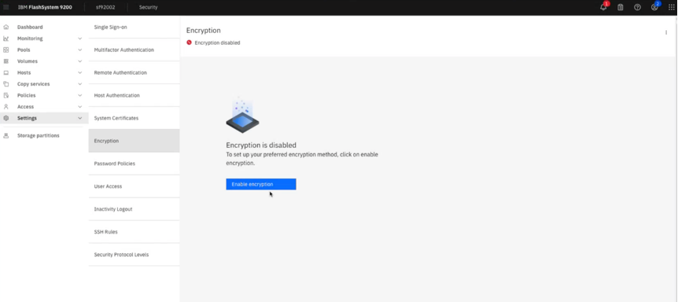
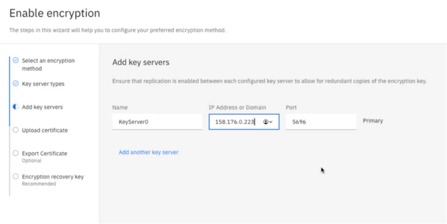

# Configuring Vault KMIP as Key Server for IBM Flash System

## Introduction
Storage Systems are data repositories that hold the key to *data-at-rest security*. Whether it is in the cloud or on an enterprise' on-premise infrastructure, storage systems have inbuilt data-protection. With multifold increase in cybersecurity incidents, regulations call for compliance with enhanced data protection standards. These standards require storage systems to obtain data-encryption-keys (DEKs) from a *Key Server*. A *Key Server*, in the context of a *Storage System*, is a [Key Management System (KMS)](https://en.wikipedia.org/wiki/Key_management#Key_management_system) that is accessible with [Key Management Interoeprability Protocol (KMIP)](https://en.wikipedia.org/wiki/Key_Management_Interoperability_Protocol). 

IBM announced the availability of [IBM Vault self-managed on IBM Z and LinuxONE](https://www.ibm.com/new/announcements/ibm-vault-self-managed-for-z-and-linuxone-and-ibm-nomad-self-managed-for-z-and-linuxone-generally-available). Vault provides a centralized approach to secrets management across every element of the application delivery lifecycle. It also provides a highly available and secure way of storing and exposing secrets to applications and users. Vault's capabilities can be enhanced by adding a KMIP-plugin, which enbales Vault to become a "Key Server" for Storage Systems.

This tutorial will provide step-by-step instructions on how to configure a Vault installation with a KMIP plugin and associating this Key Server with a storage system like [IBM Flash System](https://www.ibm.com/flashsystem). 

## Pre-reqs
- Access to s390x server | VM. If Vault needs to be configured in a Confidential Computing enclave, check [How to run IBM Vault in a Confidential Computing enclave?]()
- An IBM Vault Enterprise Vault License
- Admin access to an IBM Flash Subsystem
  

## Step 1 - Install Vault
1. Logon to the s390x server
1. Prepare the environment
   ```
   export VAULT_HOME=/etc/vault.d
   export VAULT_RAFT=/opt/vault/data
   mkdir -p $VAULT_HOME
   mkdir -p $VAULT_RAFT
   cd $VAULT_HOME
   ```
1. Download the latest version of Vault-s390x from [releases.hashicorp.com](https://releases.hashicorp.com/vault/1.19.1+ent/) and check if Vault looks good:
   ```
   wget https://releases.hashicorp.com/vault/1.18.4+ent/vault_1.18.4+ent_linux_s390x.zip
   unzip vault_1.18.4+ent_linux_s390x.zip
   ./vault version
   ```
1. Create the Vault License file by copying into a file `$VAULT_HOME/vault-ent-license.hclic`
1. Apply the vault license
   ```
   export VAULT_LICENSE=$VAULT_HOME/vault-ent-license.hclic
   ```
1. Copy [vault-sample-config.hcl](configuration-files/vault-sample-config.hcl) to `$VAULT_HOME/vault-config.hcl`
   double check the `license_path` statement points to $VAULT_LICENSE
1. Start the Vault server:
   ```
   ./vault server -config=$VAULT_HOME/vault-config.hcl
   ```
   Expect a sample output like this [vault-startup-sample-output](sample-files/vault-startup-sample-output)
1. Check Vault status
   ```
   export VAULT_ADDR=http://127.0.0.1:8205
   ./vault status
   ```
   The output should look like this:
   ```
   root@vault-cluster1:~/vault_1# ./vault status
   Key                     Value
   ---                     ----- 
   Seal Type               shamir
   Initialized             false
   Sealed                  true
   Total Shares            5
   Threshold               3
   Version                 1.19.1+ent
   Build Date              2025-03-04T09:00:50Z
   Storage Type            raft
   Cluster Name            vault-cluster-72b2023c
   Cluster ID              8abeaf0a-a5fc-aeda-92e8-8f0e42313d97
   HA Enabled              true
   HA Cluster              https://127.0.0.1:8206
   HA Mode                 active
   Active Since            2025-03-28T11:05:36.809998915Z
   Raft Committed Index    861411
   Raft Applied Index      861411
   Last WAL                330202 
   ```
1. Check Vault License status
   ```
   ./vault license inspect $VAULT_LICENSE_PATH
   ```
   The output should look something like this:
   ```
   Source: /etc/vault.d/license.hclic
   Product: vault
   License ID: 07cd369b-bb50-e993-d6bb-e0f54d4f4be6
   Customer ID: e99ff6f3-b823-dfb3-c514-06f16668de76
   Installation ID: *
   Issue Time: 2025-01-28 14:50:58.185093991 +0000 UTC
   Start Time: 2025-01-28 00:00:00 +0000 UTC
   Expiration Time: 2025-04-30 00:00:00 +0000 UTC
   Termination Time: 2025-05-31 00:00:00 +0000 UTC
   {"license_id":"07cd369b-bb50-e993-d6bb-e0f54d4f4be6","customer_id":"e99ff6f3-b823-dfb3-c514-06f16668de76","installation_id":"*","issue_time":"2025-01
   28T14:50:58.185093991Z","start_time":"2025-01-28T00:00:00Z","expiration_time":"2025-04-30T00:00:00Z","termination_time":"2025-05-31T00:00:00Z","flags":{"modules":["multi-dc
   scale","governance-policy","advanced-data-protection-key-management","advanced-data-protection-transform"]},"features":["HSM","Performance Replication","DR
   Replication","MFA","Sentinel","Seal Wrapping","Control Groups","Performance Standby","Namespaces","KMIP","Entropy Augmentation","Transform Secrets Engine","Lease Count Quotas","Key
   Management Secrets Engine","Automated Snapshots","Key Management Transparent Data Encryption","Secrets Sync"],"performance_standby_count":9999}

   License is valid
   ```
1. Initialize vault and unseal
   ```
   ./vault operator init
   ```
   The output should look something like this:
   ```
   Recovery Key 1: hy1i97i1PP9tCWX**uoyTrqAzhHs*u61JE5sNwVFdUHQ+
   Recovery Key 2: iQcyiI14+55ooBsNo**+ECPk83PtaC/4qJQkU2hJgGG7
   Recovery Key 3: 9Tru************Io/mT7HoKI0mwpl
   Recovery Key 4: yKWRklqRM/wNsmftNOR3TK**uIdK2Z/Kx7L4Ww/ORVU1
   Recovery Key 5: fRD03kNS8sICfdOb**9DioS9PY6K6yRweLWGVxiUTmVx

   Initial Root Token: hvs.7ta2pMiIpLXki**ZCkpzskHX

   Success! Vault is initialized

   Recovery key initialized with 5 key shares and a key threshold of 3. Please securely distribute the key shares printed above.
   ```
   Make a note of the *Initial Root Token* and Unseal Vault with any 3 of the recovery keys with this command:
   ```
   ./vault unseal <unseal-key>
   ```
1. Make sure Vault is now unsealed
   ```
   ./vault status
   ```
   The output should look something like this:
   ```
   Key                     Value
   ---                     -----
   Seal Type               shamir
   Initialized             true
   Sealed                  false
   Total Shares            5
   Threshold               3
   Version                 1.19.1+ent
   Build Date              2025-01-29T14:07:00Z
   Storage Type            raft
   Cluster Name            vault-cluster-18d5d356
   Cluster ID              d2f3c181-08ab-3168-ae83-0e89a1d02129
   HA Enabled              true
   HA Cluster              https://127.0.0.1:8206
   HA Mode                 active
   Active Since            2025-03-19T10:32:50.727057924Z
   Raft Committed Index    96
   Raft Applied Index      96
   Last WAL                33 
   ```

## Step 2 - Login to vault and enable KMIP
1. Login to Vault with the "Inital Root Token"
   ```
   ./vault login <initial root token>
   ```
1. Enable KMIP Secrets Engine
   ```
   ./vault secrets enable kmip
   Success! Enabled the kmip secrets engine at: kmip/ 
   ```
   ```
   vault write kmip/config listen_addrs=0.0.0.0:5696 tls_ca_key_type=rsa tls_ca_key_bits=2048 default_tls_client_key_type=rsa default_tls_client_key_bits=2048
   Success! Data written to: kmip/config 
   ```
   ```
   ./vault read kmip/config
   ```
   The output should look something like this:
   ```
   Key                            Value
   ---                            -----
   default_tls_client_key_bits    2048
   default_tls_client_key_type    rsa
   default_tls_client_ttl         336h
   listen_addrs                   [0.0.0.0:5696]
   server_hostnames               [localhost]
   server_ips                     [127.0.0.1 ::1]
   tls_ca_key_bits                2048
   tls_ca_key_type                rsa
   tls_min_version                tls12 
   ```
1. Extract the `root-ca` of the KMIP secrets engine into the file `vault-ca.pem`
   ```
   ./vault read kmip/ca -format=json | jq -r '.data | .ca_pem' >> vault-ca.pem && cat vault-ca.pem
   ```
1. Create Scope and Roles
   ```
   vault write -f kmip/scope/finance
   Success! Data written to: kmip/scope/finance
   ```
   List out KMIP Scope and Roles
   ```
   ./vault read kmip/scope/finance/role/accounting
   ```
   ```
   Key                    Value
   ---                    -----
   operation_all          true
   tls_client_key_bits    0
   tls_client_key_type    n/a
   tls_client_ttl         0s
   ```
1. Generate `Client Certificate` for IBM Flash System (FS9200)
   ```
   ./vault write -format=json kmip/scope/finance/role/accounting/credential/generate format=pem > credential.json && cat credential.json
   jq -r .data.certificate < credential.json > cert.pem
   jq -r .data.private_key < credential.json > key.pem
   ```

## Step 3 - Configure externel Key Server for IBM Flash System
1. Logon to the "IBM Flash System UI"
   
   
1. Create CSR on the IBM Flash System command line
   ```
   openssl x509 -req -in CAvault.csr -CA CARoot_cert.pem -CAkey CARootPrivateKey.pem -CAcreateserial -days 365 -extfile openssl.cnf -extensions v3_req -out EndPointCluster01.pem
   ```
1. Copy the CSR file `fs9200_cert_new.csr` to the Vault Server and `sign` it with this command:
   ```
   ./vault write -f kmip/scope/finance/role/accounting/credential/sign csr=@/etc/vault.d/fs9200_cert_new.csr 
   ```
   - copy the ca-chain to the file `vault-kmip-ca-chain.pem`
   - copy the certificate to the file `fs9200-vault-certificate.pem`
1. On the "IBM Flash System UI", navigate to `Settings -> Encryption` and click on `Enable Encryption`
   
   
1. Select "Key Server" and choose "Thales CipherTrust Manager"
   

   - No need to provide userid / password on this screen
   - Go to the next step
1. On the "Add Key Server" panel,
   

   - Enter the `external` IP address of the KMIP Server
   - Enter the Port number of the KMIP Server
   - Proceed to the next screen
1. On the next panel, upload the certificate from the KMIP server
   - vault-kmip-ca-chain.pem
1. If all configuration elements are in place, the Flash System should be able to establish connection with the Vault-KMIP Key Server
   

## Step 4 - Configure volume encryption on IBM Flash System
On the IBM Flash System UI,
1. Create an "Encrypted Volume Pool" for encrypted volumes, by navigating to Volumes -> Volumes by pool -> "Create Pool"
   

   - select "encryption"
   - select a provisioning policy

1. Add "storage" to the volume pool by clicking on "Pool Actions" -> "Add Storage"
  

  - choose the number of drives
  - choose the RAID level
  - check the total storage provisioned
  - click on "Add Storage"

  
  
1. Create an "Encrypted Volume" in the "Encrypted Volume Pool", by navigating to Volumes -> "Create Volumes"
   

   Click on "Define Volume Properties" with a volume name, for example `vault-kmip-encrypted-vol`
   

   Back on the "Create Volumes" panel, click on "Create Volumes"
   

1. The encrypted volume must be available now for use:
   

## Conclusion
Now that you have gone through the whole process of creating encrypted volumes with KMIP on Vault, try creating some files on the encrypted volumes. Make sure the data in the volumes is encrypted. To further fortify the configuration, the Vault installation can be integrated with the IBM HSM on LinuxONE.
